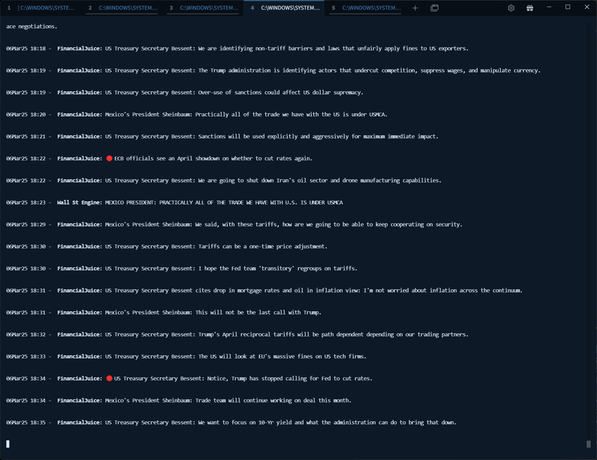

Features:
> Mirrors posts a list of provided twitter sources to your terminal.
> 
> Optional forwarding to Discord webhooks.
> 
> Optimized request rate keeps account (soft and hard) bann risk to a minimum.

!!! Caution: Risk of ban !!!
> Do not use your main account and back it up!
> 
> Always use dummy accounts for this. Recommendation: trash-mail.com
> 
> Minimize logical linkage. (Shared IP seems to be okay)
>
> Soft bans can be healed by solving a CAPTCHA.
>
> Do not restart the script in a frenquency higher than it's normal rate of requests.

Install:
> uv sync

Run:
> uv run main.py

Example:

